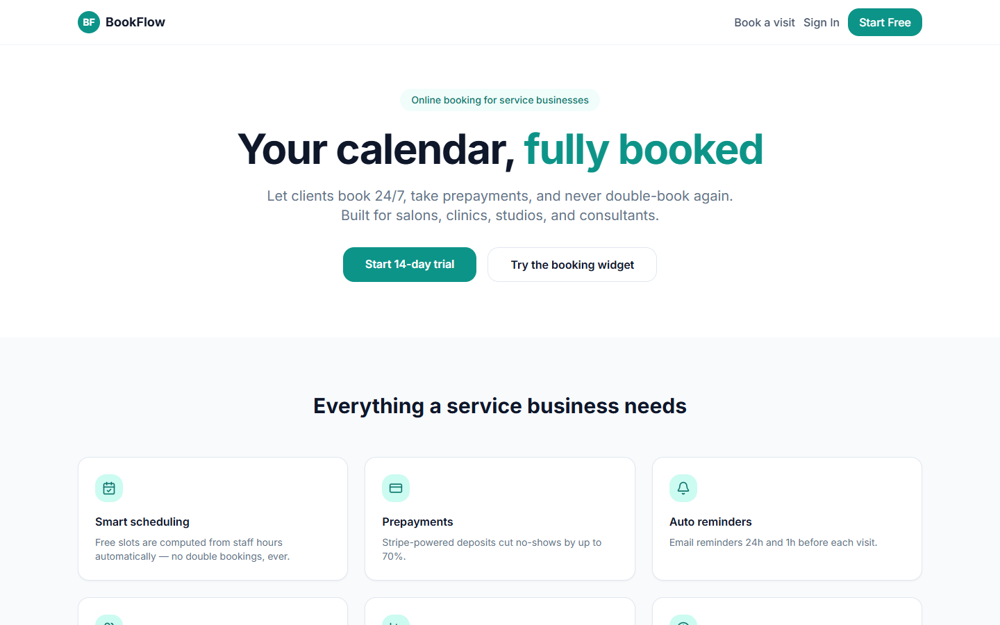
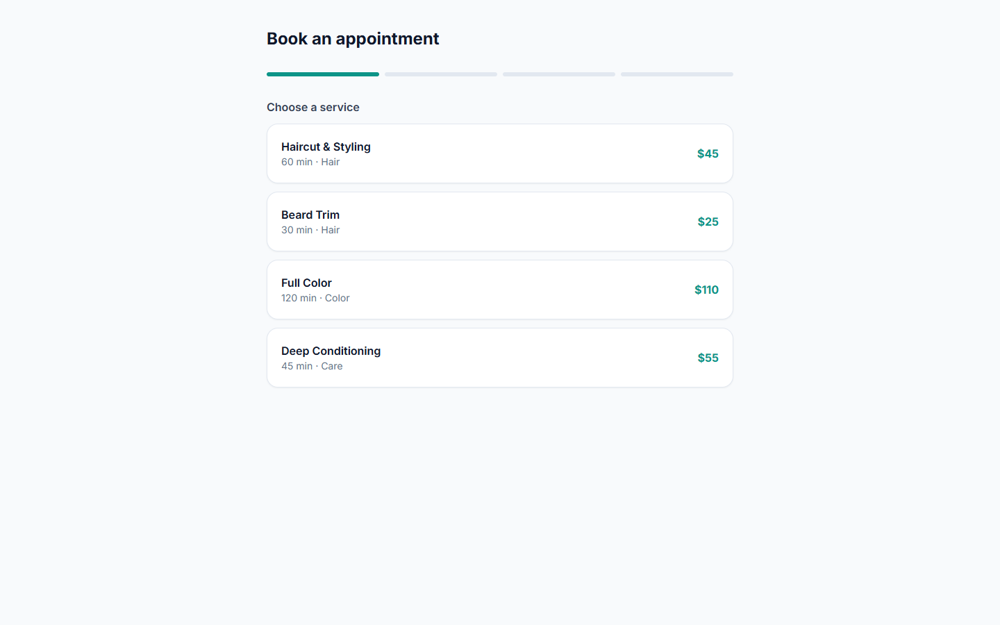
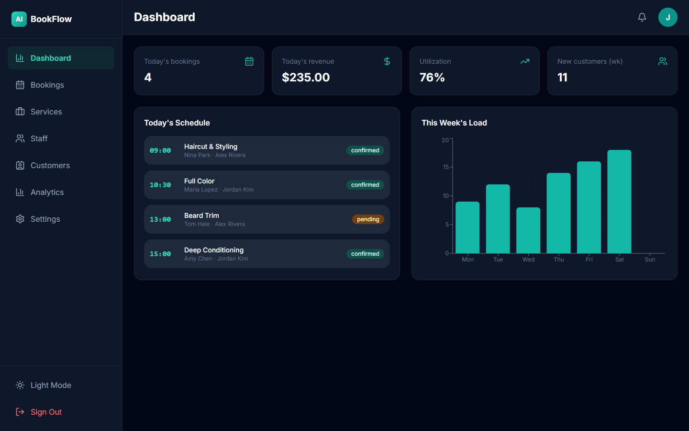
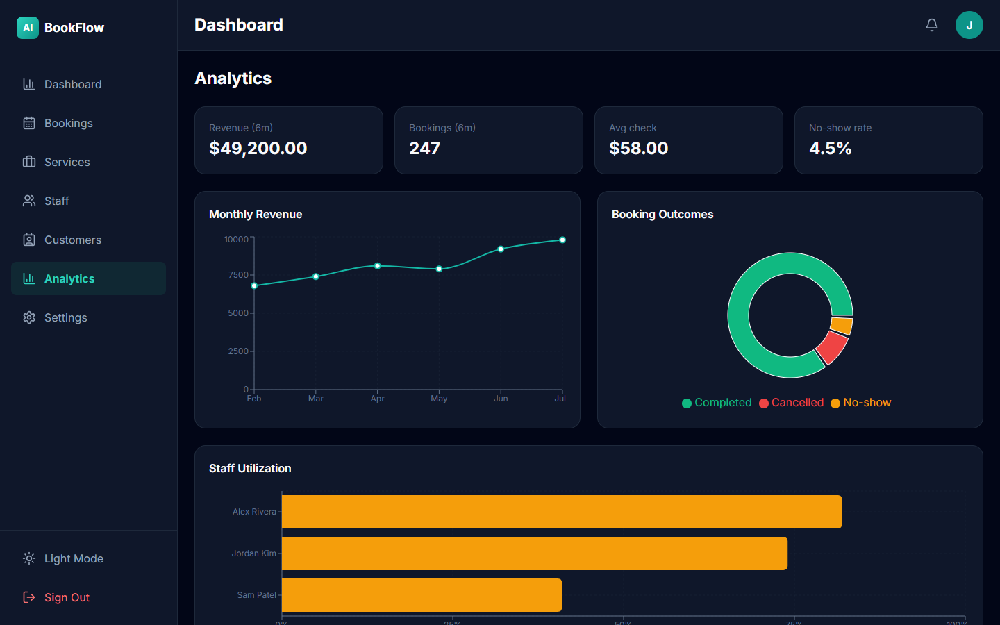

# BookFlow — Online Booking System

Booking platform for service businesses: public booking widget, smart slot calculation, staff schedules, Stripe deposits, email reminders, and revenue analytics.

## Tech Stack
Next.js 15 (App Router), React 19, TypeScript, Tailwind CSS, Supabase (PostgreSQL + Auth + RLS), Stripe, Resend, Recharts, Zod.

## Features
- 🗓️ Public multi-step booking widget (`/book`) — service → specialist → time slot → contact details
- ⚙️ Slot engine: free slots computed from staff working hours minus existing bookings (pure, testable function)
- 🚫 Double-booking prevented at the database level (partial unique index)
- 💳 Stripe deposits (mock mode without keys)
- ✉️ Email confirmations & reminders via Resend (mock mode logs)
- 📅 Google Calendar sync adapter (mock mode)
- 📊 Analytics: revenue, staff utilization, no-show rate
- 👥 CRUD for services, staff, customers; booking management with filters
- 🌙 Dark/light theme, responsive, route protection

## Quick Start
```bash
npm install
cp .env.example .env.local   # fill in Supabase credentials
# Run sql/schema.sql in the Supabase SQL editor
npm run db:seed
npm run dev
```
Open http://localhost:3000 — the booking widget at `/book` works entirely without external keys.

## Environment Variables
| Variable | Required | Description |
|---|---|---|
| `NEXT_PUBLIC_SUPABASE_URL` | ✅ | Supabase project URL |
| `NEXT_PUBLIC_SUPABASE_ANON_KEY` | ✅ | Supabase anon key |
| `SUPABASE_SERVICE_ROLE_KEY` | seed only | For the seed script |
| `STRIPE_SECRET_KEY` | ❌ | Without it payments run in mock mode |
| `RESEND_API_KEY` | ❌ | Without it emails are logged, not sent |
| `GOOGLE_CALENDAR_CREDENTIALS` | ❌ | Without it calendar sync is logged |

## Demo Credentials
```
demo@example.com / Demo123!
```
(Create in Supabase Auth dashboard, then run seed.)

## Architecture Highlights
- `src/services/availability.service.ts` — pure slot-calculation engine, no I/O
- `src/services/payment.service.ts` — Stripe behind a stable interface with mock fallback
- `src/services/notification.service.ts` — Resend + Google Calendar adapters, mock-first
- `sql/schema.sql` — RLS per business, indexes, DB-level double-booking guard

## Deployment
See [DEPLOYMENT.md](DEPLOYMENT.md). TL;DR: Supabase (run schema + seed) → Vercel (import repo, set env vars) → done.

## Scripts
`dev`, `build`, `start`, `lint`, `type-check`, `db:seed`

## License
MIT

## Screenshots

### Landing


### Book


### Dashboard


### Analytics


